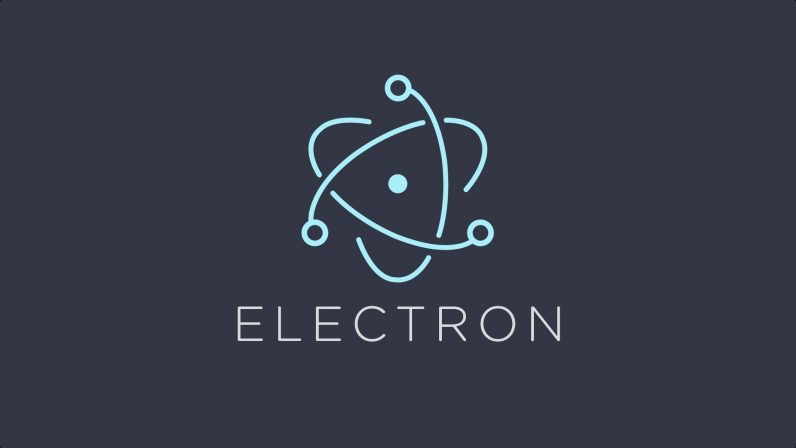

# Electron
My works related to Electron.

## Table of Contents
1. [Introduction.](#introduction)
2. [Official references websites.](#references)
3. [GitHub notes.](#github)
4. [GitHub repository calculation.](#calculation)

<a name="introduction"></a>
## 1. Introduction.
 
Electron, formerly known as Atom Shell is an open-source framework developed and maintained by GitHub. Electron allows for the development of desktop GUI applications using web technologies: It combines the Chromium rendering engine and the Node.js runtime. Electron is the main GUI framework behind several notable open-source projects including Atom, GitHub Desktop, Light Table, Visual Studio Code, and WordPress Desktop.

<a name="references"></a>
## 2. Official references websites. <br />
Electron official website : https://www.electronjs.org <br />
Electron official GitHub : https://github.com/electron/electron <br />
Electron official Twitter : https://twitter.com/electronjs <br />

**_Electron related projects_**
The Chromium Projects : https://www.chromium.org <br />
Mojibar by Mu-An : https://github.com/muan/mojibar <br />
Playback by Mathias Buus : https://github.com/mafintosh/playback <br />

**_Electron developers_**
Mathias Buus : https://github.com/mafintosh <br />
Mu-An : https://github.com/muan <br />

<a name="github"></a>
## 3. GitHub notes.
Clone the current GitHub remote repository contents into local machine.
```
$ git clone https://github.com/syakirharis25/Electron.git
$ cd Electron/
$ git remote -v
$ git status
```

GitHub markdown-cheatsheet by tchap : https://github.com/tchapi/markdown-cheatsheet/blob/master/README.md

<a name="calculation"></a>
## 4. GitHub repository calculation.
```
-------------------------------------------------------------------------------
Language                     files          blank        comment           code
-------------------------------------------------------------------------------
Markdown                         1              5              0             23
-------------------------------------------------------------------------------
```
Refer to : https://github.com/syakirharis25/cloc
